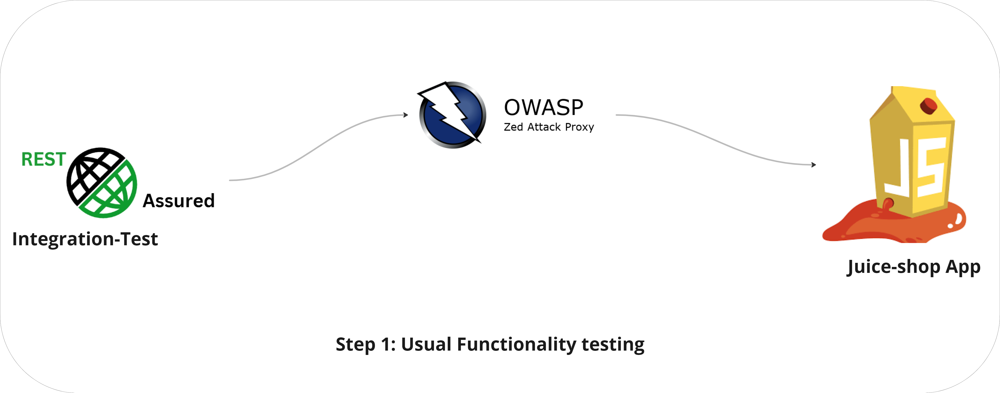
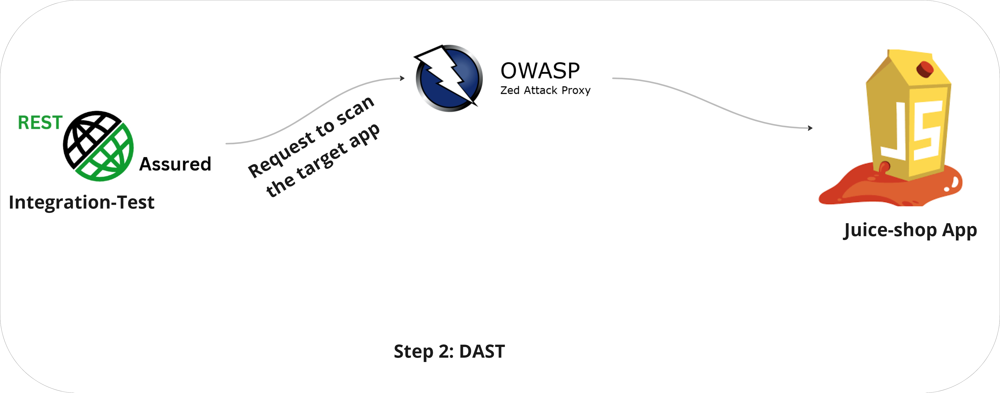

# Juice-Shop Test Guide

Welcome to the Juice-Shop Test repository! This project is a straightforward example of how to blend functionality testing with Dynamic Application Security Testing (DAST) using the ZAP tool.

### What’s Covered in This Project?

In this project, you'll learn how to:
- Test the REST APIs of the Juice-Shop app, a purposely vulnerable application.
- Use the ZAP proxy to scan and identify vulnerabilities within the Juice-Shop app.

### How Does It Work?

This testing process is split into two key steps:

1. **Integration Testing with ZAP Interception**:
    - We start by sending requests to the various APIs of the Juice-Shop app.
    - As these requests are made, the ZAP proxy steps in to intercept and monitor them.
- 

2. **Vulnerability Scanning with ZAP**:
    - After the functionality tests are complete, we move on to the DAST phase.
    - In this phase, ZAP thoroughly scans the Juice-Shop app to uncover any security vulnerabilities.
- 

If you're new to ZAP or need a refresher, check out the [ZAP sample project](https://github.com/diconium/ZAP-sample-project) for a detailed explanation of the proxy setup.

The DAST tool generates an HTML report, and you can see an example of this report in the attachment.