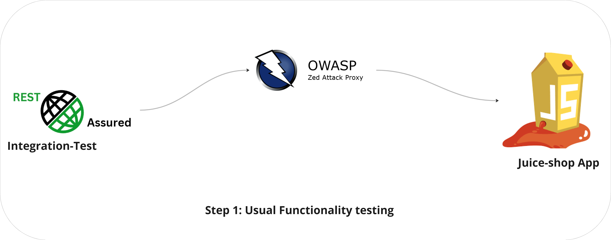
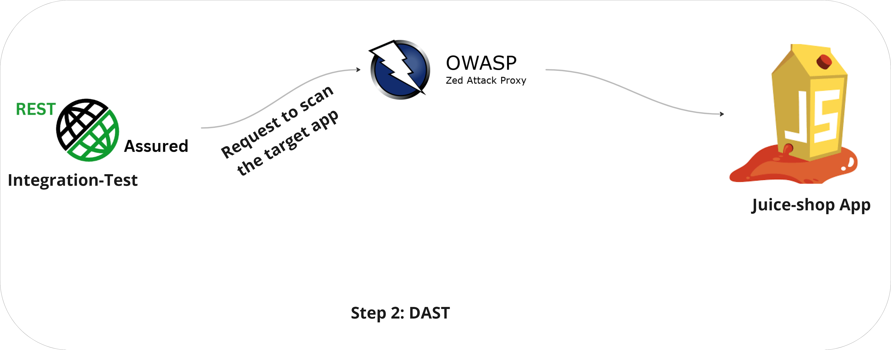
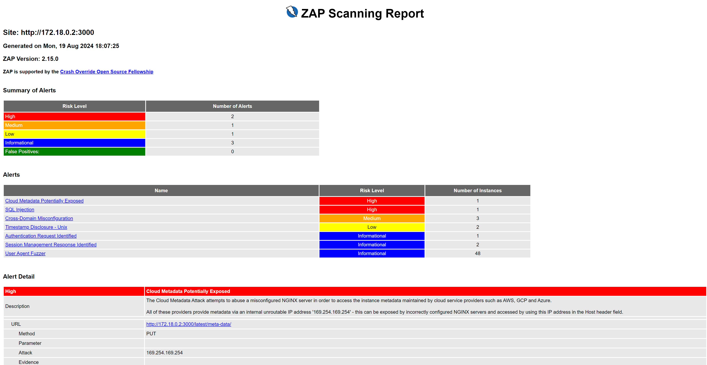

## Table of Contents

- [Juice-Shop Test Guide](#juice-shop-test-guide)
  - [What’s Covered in This Project?](#whats-covered-in-this-project)
  - [How Does It Work?](#how-does-it-work)
    - [Integration Testing with ZAP Interception](#integration-testing-with-zap-interception)
    - [Vulnerability Scanning with ZAP](#vulnerability-scanning-with-zap)
- [How to use this repository?](#How-to-use-this-repository?)
- [DAST Report](#dast-report)
- [API Description](#api-description)
  - [Get List of Created ZAP Contexts](#get-list-of-created-zap-contexts)
  - [Include the Services Which Must Be Scanned](#include-the-services-which-must-be-scanned)
  - [Get ID of Created Context](#get-id-of-created-context)
  - [Trigger an Active Scan on Context](#trigger-an-active-scan-on-context)
  - [Wait Until Scan is 100% Completed](#wait-until-scan-is-100-completed)
  - [Get All Alerts](#get-all-alerts)
  - [Ignore False-Positive Alerts](#ignore-false-positive-alerts)
  - [Generate Report](#generate-report)

# Juice-Shop Test Guide

Welcome to the Juice-Shop Test repository! This project is a straightforward example of how to blend functionality testing with Dynamic Application Security Testing (DAST) using the ZAP tool. You can check out the [ZAP sample project](https://github.com/diconium/ZAP-sample-project) for a detailed explanation of the proxy setup.

### What’s Covered in This Project?

In this project, you'll learn how to:
- Test the REST APIs of the Juice-Shop app, a purposely vulnerable application.
- Use the ZAP proxy to scan and identify vulnerabilities within the Juice-Shop app.

### How to use this repository ?
You can simply:
- Open the Actions
- Choose "Run Docker Compose"
- Run the workflow
- In a few minutes an API test will be run against jucie-shop app
- When the build is successfull then download the ZAP report from artifacts

 

### How Does It Work?

This testing process is split into two key steps:

1. **Integration Testing with ZAP Interception**:
    - We start by sending requests to the various APIs of the Juice-Shop app.
    - As these requests are made, the ZAP proxy steps in to intercept and monitor them.

    - 

2. **Vulnerability Scanning with ZAP**:
    - After the functionality tests are complete, we move on to the DAST phase.
    - In this phase, ZAP thoroughly scans the Juice-Shop app to uncover any security vulnerabilities.
    - 

## DAST Report

The DAST tool generates an HTML report, and you can see an example of this report in the attachment.

---
## API description 
If you want to communicate with ZAP in daemon mode, you can use the following REST APIs. Please adjust the host and port settings as needed.

Get list of created ZAP contexts ! At the very beginning of the test, before your integration test is executed, we created a context (using curl command) in ZAP because there is no context by default in daemon mode. We just need to check it again to make sure this context is setup there successfully.

- `curl -X GET "http://ZapHost:9090/JSON/context/view/contextList`

- --

Include the services which must be scanned ! This step limits the number of services that need to be scanned, thereby reducing the runtime of test:

- `curl -X GET "http://ZapHost:9090/JSON/context/action/includeInContext/?contextName=Default Context&regex=".*(service3|service2|service1).*""`

- --

Get Id of created context ! To trigger the scan, we need to know the ID of the context within the ZAP service.

- `curl -X GET "http://ZapHost:9090/JSON/context/view/context/?contextName=ZAP_CONTEXT"`

- --

Trigger an active scan on context ! This request triggers an active scan based on the created context. Please make sure you have permission to perform such a scan on the target services.

- `curl -X GET "http://ZapHost:9090/JSON/ascan/action/scan/?contextId=1"`

- --

Wait until scan is 100% completed ! Usually, ZAP performs many different tests on target URLs, which can take some time to complete. Therefore, we need to wait and consistently check its progress.

- `curl -X GET "http://ZapHost:9090/JSON/ascan/view/status/?scanId=1"`

- --

Get all alerts ! Not all the findings from ZAP might be valid, so it makes sense to get a list of all detected vulnerabilities and in the next step, we can label any false-positive alerts.

- `curl -X GET "http://ZapHost:9090/JSON/core/view/alerts/"`

- --

Ignore the false-positive alerts in the scan using the IDs of the alerts.

- `curl -X GET
"http://ZapHost:9090/JSON/alert/action/updateAlert/?id=0&confidenceId=0&name="Ignored alert"&riskId=0&description="False-positive alert"`

- --

Generate report! Like any other test execution, it makes sense to generate an HTML report of the test. This way, you can include it as an artifact of the CI/CD pipeline.

- `curl -X GET "http://ZapHost:9090/OTHER/core/other/htmlreport/"`
